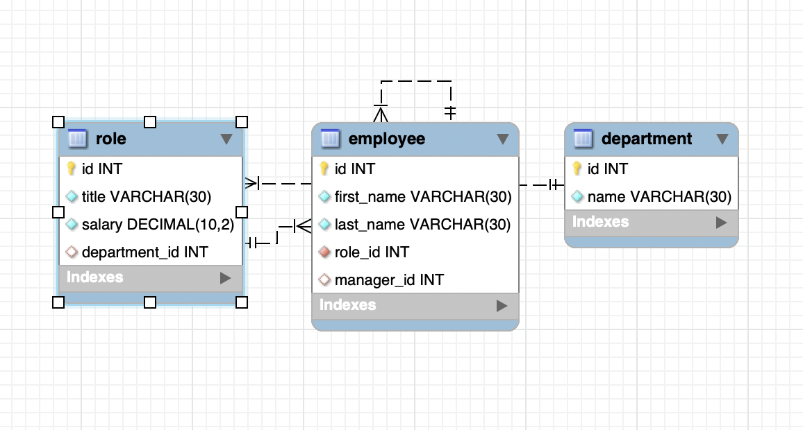

# Employee_Tracker

[](https://opensource.org/licenses/MIT)

## Description

This is a node application for employee content management utilizing MySQL for a database. By using the command-line an employeer is able to do the following:

- Add departments, roles, employees

- View departments, roles, employees

- Update employee roles, employee managers

- Delete departments, roles, and employees

- View the total utilized budget of a department -- ie the combined salaries of all employees in that department

## Schema

The following shows database schema:



## Demo video


## Table of Contents

- [**Installation**](#installation)
- [**Usage**](#usage)
- [**License**](#license)
- [**Contributing**](#contributing)
- [**Tests**](#tests)
- [**Questions**](#questions)

## Installation

To install all required dependencies, you will need to run the following in the node.js command line:

```
npm install
```

If you would like to run this program without forking you will need to run the following commands for set up:

```
npm init -y
npm i inquirer
npm i mysql
npm i figlet
npm i consol.table
```

## Usage

To initiate the program you will need to run the following command:

```
node app.js
```

## License

This project is licensed under the [**MIT**](https://opensource.org/licenses/MIT) license.

## Contributing

If you would like to contribute to this project, fork and clone the repository so that you can commit your updates.

## Tests

At this time there are no test to be performed.

## Questions

If you have any questions please use the contact information below to reach out.

-Github Profile: [**sayler3**](https://github.com/sayler3)

-Email: **s.ayler@me.com**
